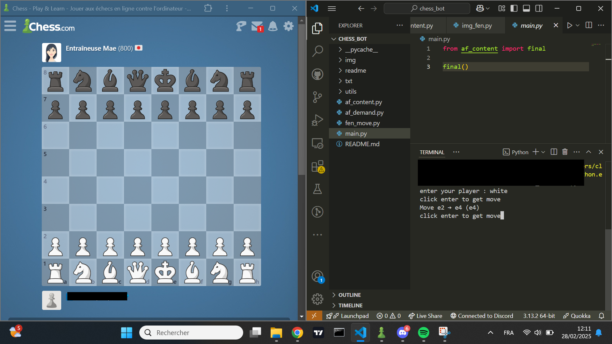

# Chess Assistant Project

## Description
This project allows you to take a screenshot of the chessboard, extract the FEN using the **Chessvision.ai** API and with **Stockfish** (chess engine), and obtain the best move thought out 12 moves in advance (don't try to understand the moves, you won't be able to).

## Features
- Take a screenshot of the chessboard.
- Send the image to the **ChessVision.ai** API.
- Extract the FEN notation.
- Send the FEN to **Stockfish** and get the best move.

## Prerequisites
Before running the project, make sure you have installed the following dependencies:

- Python 3.x
- `requests`
- `pyautogui`
- `base64`

You can install requirements using the following command:
```bash
pip install requests pyautogui base64
```

## Installation
1. Clone the repository or download the files:
```bash
git clone https://github.com/your-repo/chess-fen-extractor.git
cd chess-fen-extractor
```
2. Modify the User path in `fen_move.py`, `af_demand.py`, `af_content.py`, `img_fen.py(in utils folder)`

## Usage
Share page between VScode and chessboard.



Run the main script:
```bash
python main.py
```
Follow the on-screen instructions to select the player’s turn (`black` or `white`).
And click enter when you want to get the next movement

## Project Structure
```
Chess FEN Extractor/
│── main.py          # file to launch
│── fen_move.py
│── af_demand.py
│── af_content.py
│── img/           # picture of chessboard
│── utils/           # utils files
│── txt/           # fen and stockfish data
```

## Example Output
After executing the script, you will obtain a move like this :
```
enter your player : white
click enter to get move (ive click enter key)
Move d2 → d4 (d4)
click enter to get move

```


**Author:** kr1p_h4x0r
